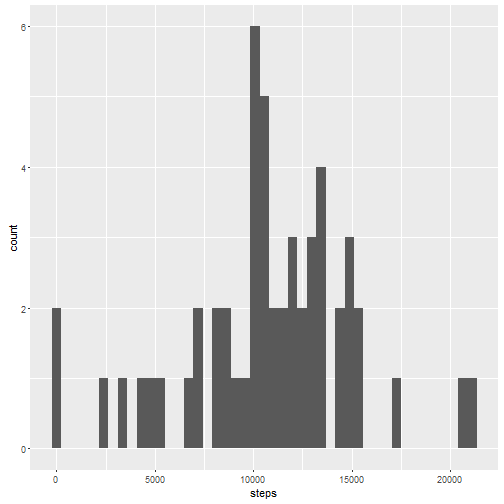
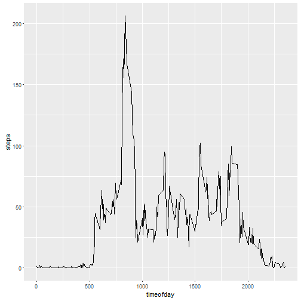
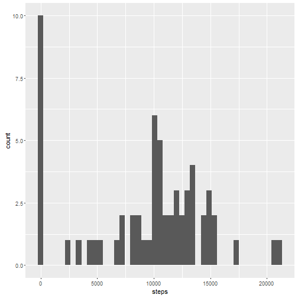
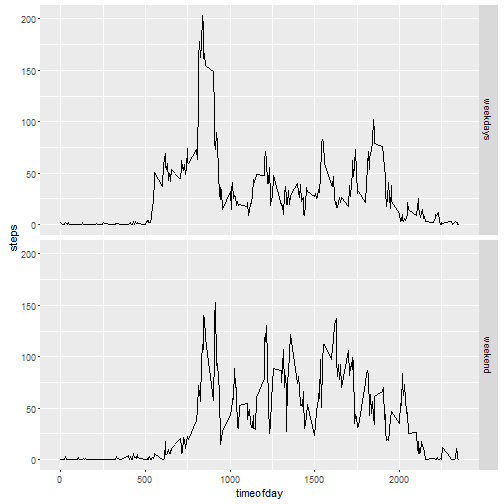

Reproducible Research: Peer Assessment 1
========================================

This is the markdown for the Assessment on Reproducible Research course.

## Loading and preprocessing the data
First one we will load the data and preprocess it.

```r
DatosEntrada <- read.csv("activity.csv")
DatosEntrada$interval <- formatC(DatosEntrada$interval, width = 4, flag = "0")
DatosEntrada$interval <- paste(substr(DatosEntrada$interval, 1, 2), ":",
                               substr(DatosEntrada$interval, 3,4), sep = "")
DatosEntrada$datetime <- strptime(paste(DatosEntrada$date, " ", 
                            DatosEntrada$interval), format = "%Y-%m-%d %H:%M")
longitud <- length(DatosEntrada$date)
```
We've read 17568 registers in activity file.

## What is mean total number of steps taken per day?
We first aggregate the data and then do the plot and the calculations

```r
library(ggplot2, verbose = FALSE)
DatosPasospordia <- with(DatosEntrada, aggregate(steps, by = list(date), 
                                                 FUN = "sum"))
names(DatosPasospordia) <- c("date", "steps")
ggplot(aes(steps), data = DatosPasospordia)+geom_histogram(na.rm = TRUE, 
                                                           binwidth = 480)
```



```r
DatosMeanPasospordia <- as.integer(mean(DatosPasospordia$steps, na.rm = TRUE))
DatosMedianPasospordia <- as.integer(median(DatosPasospordia$steps, 
                                            na.rm = TRUE))
```
The mean steps by day is 10766 and the median steps by day
is 10765.

## What is the average daily activity pattern?
Calculate the average across each interval and show the graphic.

```r
DatosPasosporintervalo <- with(DatosEntrada, aggregate(steps, 
                        by = list(interval), 
                        FUN = "mean", na.rm = TRUE))
names(DatosPasosporintervalo) <- c("interval", "steps")
Intervalo <- which.max(DatosPasosporintervalo$steps)
DatosMaxInterval <- DatosPasosporintervalo[Intervalo,1]
DatosMaxPasosporintervalo <- DatosPasosporintervalo[Intervalo,2]
DatosPasosporintervalo$timeofday <- as.numeric(paste(
                    substr(DatosPasosporintervalo$interval,1,2), 
                    substr(DatosPasosporintervalo$interval,4,5), sep= ""))
ggplot(aes(timeofday, steps, group = 1), data = DatosPasosporintervalo)+geom_line()
```



The interval with a greater number of steps (main) is 08:35 and
in mean they did 206.1698113 steps.

## Imputing missing values
Locate NA values, count them and then estimate again the values filling NA
values with the mean of this interval

```r
DatosNANumber <- sum(is.na(DatosEntrada$steps))
print(paste("There are",DatosNANumber, "missing values"))
```

```
## [1] "There are 2304 missing values"
```

```r
DatosProcesados <- merge(DatosEntrada, DatosPasosporintervalo, by = "interval")
DatosProcesados$steps.x[is.na(DatosProcesados$steps.x)] <- DatosProcesados$steps.y
```

```
## Warning in DatosProcesados$steps.x[is.na(DatosProcesados$steps.x)] <-
## DatosProcesados$steps.y: number of items to replace is not a multiple of
## replacement length
```

```r
DatosPasospordia <- with(DatosProcesados, aggregate(steps.x, by = list(date), 
                                                 FUN = "sum"))
names(DatosPasospordia) <- c("date", "steps")
ggplot(aes(steps), data = DatosPasospordia)+geom_histogram(na.rm = TRUE, 
                                                           binwidth = 480)
```



```r
DatosMeanPasospordia <- as.integer(mean(DatosPasospordia$steps, na.rm = TRUE))
DatosMedianPasospordia <- as.integer(median(DatosPasospordia$steps, 
                                            na.rm = TRUE))
```
The mean steps by day is 9371 and the median steps by day
is 10395.

As you can see there is an important difference between skip NAs or filling it.

## Are there differences in activity patterns between weekdays and weekends?
First of all categorize all the registers in "weekdays" and "weekends" and look
if there are any differences

```r
DatosProcesados$typeofday <- "weekdays"
DatosProcesados$typeofday[weekdays(DatosProcesados$datetime)=="sábado"] <- 
    "weekend"
DatosProcesados$typeofday[weekdays(DatosProcesados$datetime)=="domingo"] <- 
    "weekend"
DatosPasosporintervalo <- with(DatosProcesados, aggregate(steps.x, 
                        by = list(interval, typeofday), 
                        FUN = "mean", na.rm = TRUE))
names(DatosPasosporintervalo) <- c("interval", "typeofday", "steps")
Intervalo <- which.max(DatosPasosporintervalo$steps)
DatosMaxInterval <- DatosPasosporintervalo[Intervalo,1]
DatosMaxPasosporintervalo <- DatosPasosporintervalo[Intervalo,2]
DatosPasosporintervalo$timeofday <- as.numeric(paste(
                    substr(DatosPasosporintervalo$interval,1,2), 
                    substr(DatosPasosporintervalo$interval,4,5), sep= ""))
qplot(timeofday, steps, data = DatosPasosporintervalo, geom = "line", 
      facets = typeofday ~ .)
```


